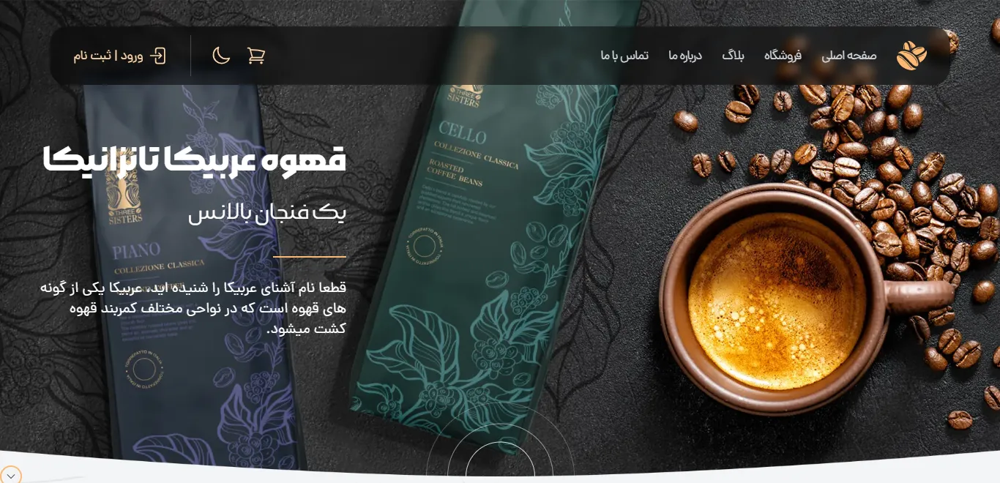

# React + Vite

## About Project
Ready template for a coffee shop website called golden coffee

### See <a href='https://goldencoffee.liara.run'>Demo</a>

## Getting Started
First, run the development server
```bash
npm run dev
# or
yarn dev
```

Second, run the TailwindCss compiler
```bash
npm run tailwind
# or
yarn tailwind
```

Now, open <a href='http://localhost:5173/'>http://localhost:5173</a> with your browser to see the result

## Developed with


### Made with ❤ by Hadi Heidariazar